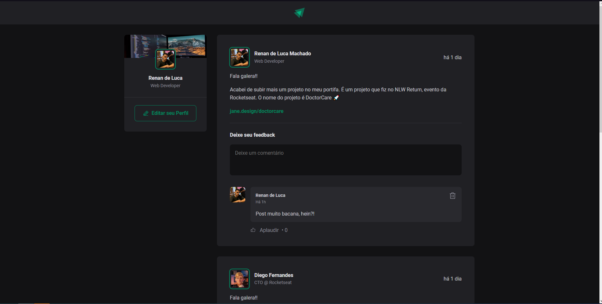

<h1 align="center">
 
</h1>
<p align="center">
  <a href="#-tecnologias">Tecnologias</a>&nbsp;&nbsp;&nbsp;|&nbsp;&nbsp;&nbsp;
  <a href="#-projeto">Projeto</a>&nbsp;&nbsp;&nbsp;|&nbsp;&nbsp;&nbsp;
  <a href="#-como-rodar">Como rodar</a>&nbsp;&nbsp;&nbsp;|&nbsp;&nbsp;&nbsp;
  <a href="https://ignite-feed-coral-theta.vercel.app" target="_blank">Confira o site</a>
</p>

<br>




## 🚀 Tecnologias

Esse projeto foi desenvolvido com as seguintes tecnologias:

- [Vite](https://vitejs.dev/)
- [React JS](https://pt-br.reactjs.org/)
- [TypeScript](https://www.typescriptlang.org/)
- [TypeScript](https://www.figma.com)

## 💻 Projeto

Neste projeto, desenvolvi uma rede social como parte do curso Ignite. Ao seguir as aulas do primeiro módulo, pude explorar e compreender os principais fundamentos do React, incluindo a componentização, o gerenciamento de propriedades, estados, entre outros aspectos cruciais. Essa abordagem permitiu-me absorver o conteúdo de forma eficaz e sólida.

## 🧱 Layout
<p> <a href="https://urx1.com/xQnzp" target="_blank"> Veja o layout do projeto! </a> </p>

## 🖼 Confira a Demo
 <a href="https://ignite-feed-coral-theta.vercel.app" target="_blank">Confira o Site</a>

## 🔧 Como rodar


### 🗂 Faça um clone do projeto

```bash
git clone https://github.com/RenanLuca/igniteFeed.git
```

### 📥 Instale as dependências
```bash
# Acesse o diretório do projeto
cd ignite-feed

# Instale as dependências
yarn i
```

### ⚡ Inicie a aplicação
```bash
yarn run dev
```

Me adicione no [LinkedIn](https://www.linkedin.com/in/renanLuca/) :wave:
